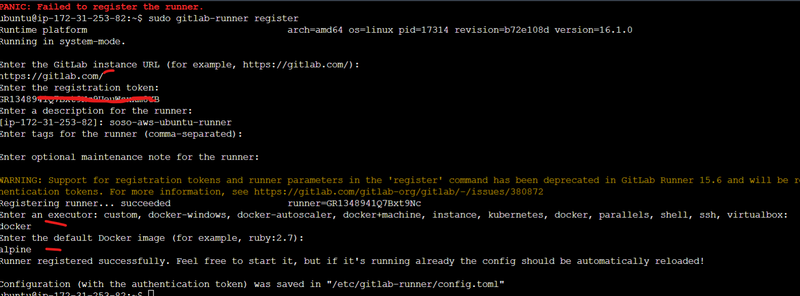

***Install Docker using Script***

```sh
#!/bin/bash
# Install Docker
sudo su -
sudo apt-get update -y
sudo apt-get install ca-certificates curl gnupg -y
sudo install -m 0755 -d /etc/apt/keyrings
curl -fsSL https://download.docker.com/linux/ubuntu/gpg | sudo gpg --dearmor -o /etc/apt/keyrings/docker.gpg
sudo chmod a+r /etc/apt/keyrings/docker.gpg 
echo "deb [arch=$(dpkg --print-architecture) signed-by=/etc/apt/keyrings/docker.gpg] https://download.docker.com/linux/ubuntu $(. /etc/os-release && echo "$VERSION_CODENAME") stable" | sudo tee /etc/apt/sources.list.d/docker.list > /dev/null

sudo apt-get update -y
sudo apt-get install docker-ce docker-ce-cli containerd.io docker-buildx-plugin docker-compose-plugin -y
sudo usermod -aG docker ubuntu
```


***Download git lab runner***

```
curl -LJO "https://gitlab-runner-downloads.s3.amazonaws.com/latest/deb/gitlab-runner_amd64.deb"
```

***Install git lab runner***

```
sudo dpkg -i gitlab-runner_amd64.deb
```

***IN GITLAB CONSOLE***

- Creat a Group
- Create a project in the croup
- Go to CICD and obtain secret from runner

***Start the runner registration prompt***

```
sudo gitlab-runner register
```



```
sudo gitlab-runner status
```

***Create a file in the project repo***

.gitlab-ci.yml

```yaml
build:
    image: alpine
    script:
        - echo "Hello from cafanwi" > index.html
    artifacts:
        paths:
            - index.html 

```

***Edit the config.toml file, change [ privileged = false] to [privileged = true]***

```
sudo vim /etc/gitlab-runner/config.toml
```

***update the pipeline file*** 

```yaml
stages:
    - build
    - package

build:
    image: alpine
    stage: build
    script:
        - echo "Hello Docker" > index.html
    artifacts:
        paths:
            - index.html 


build docker image:
    image: docker
    stage: package
    services:
        - docker:dind
    variables:
        DOCKER_TLS_CERTDIR: ""
    script:
        - echo $CI_REGISTRY_PASSWORD | docker login -u $CI_REGISTRY_USER $CI_REGISTRY --password-stdin
        - docker build -t $CI_REGISTRY_IMAGE .
        - docker image ls
        - docker push --all-tags $CI_REGISTRY_IMAGE
```

***Create a dockerfile in same root directory in the repo***

```Dockerfile
FROM nginx
COPY index.html /usr/share/nginx/html
```

***OTHER OPTIONAL COMMANDS***

```
# Give it permission to execute
sudo chmod +x /usr/local/bin/gitlab-runner

# Create a GitLab Runner user
sudo useradd --comment 'GitLab Runner' --create-home gitlab-runner --shell /bin/bash

# Install and run as a service
sudo gitlab-runner install --user=gitlab-runner --working-directory=/home/gitlab-runner
sudo gitlab-runner start
# Command to register runner
sudo gitlab-runner register --url https://gitlab.com/ --registration-token TDGncjd6DY832Y7huDSCDVJEV
```


